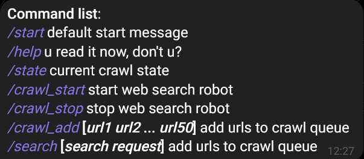
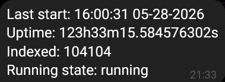
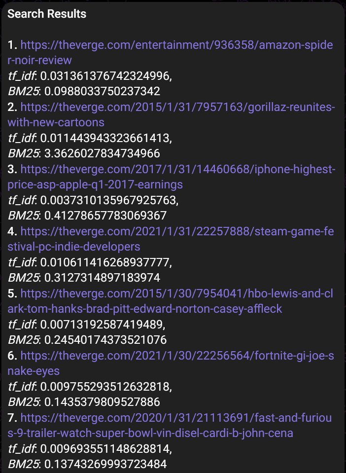

## Minimalistic telegram client for [wfts](https://github.com/box1bs/wfts)
 

## Command overview
### /help
Shows the command list with description to each one

### /state
Shows current crawl state from [wfts](https://github.com/box1bs/wfts) server.

Access to less info then using the api directly.

### /crawl_start
Start indexing on the remote server.

### /crawl_stop
Stop indexing on the remote server.

### /crawl_add (awaits for a list of <50 urls)
Add some non-empty list of valid urls.

### /search (some string)
Return list of relevant sites with relevance metrics.

